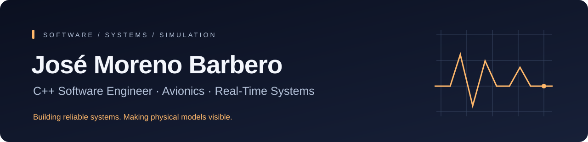

  

  <a href="https://www.linkedin.com/in/jose-moreno-barbero/">LinkedIn</a> ·
  <a href="mailto:josemorenob@gmail.com">Email</a> ·
  <a href="https://github.com/JoseMorenob?tab=repositories">Projects</a>

I build C++ software for systems where correctness, state management and integration matter. My work includes **Airbus C295 avionics software**, real-time development, inter-process communication, verification and debugging.

I also explore the connection between **physical simulation and computer graphics**: turning mathematical models into software you can run, inspect and validate.

## Featured — IRSim

**Physics-based infrared rendering in Unreal Engine 5.**

My completed MSc thesis project at **U-tad**, now continuing toward a fuller integration workflow. It combines an independent C++17 radiometry core, reusable Unreal components, physical capture buffers and a separate detector-processing demonstration.

**[Explore the project](https://github.com/JoseMorenob/thermalSimulationUnreal)** · **[Watch the demo](https://github.com/JoseMorenob/thermalSimulationUnreal/raw/refs/heads/main/Documentation/Media/irsim-showcase.mp4)** · **[Technical integration guide 🇪🇸](https://github.com/JoseMorenob/thermalSimulationUnreal/blob/main/Documentation/INTEGRACION.md)**

## Engineering focus

| Area | What I work with |
|---|---|
| **Systems software** | C++17, C, real-time execution, component interfaces, event queues and state coordination. |
| **Verification & integration** | Requirements-oriented development, logs, traces, debugging and GDB. |
| **Simulation & graphics** | Unreal Engine 5, OpenGL, HLSL, CUDA and OpenCV. |
| **Development workflow** | Linux, Python, CMake, Git, Jenkins and Docker. |

## More projects

| Project | Focus |
|---|---|
| [CUDA Image Processing](https://github.com/JoseMorenob/programacion-concurrente) | GPU kernels, reductions, HDR tone mapping and seam carving. |
| [Ray Tracer](https://github.com/JoseMorenob/realistic-rendering-and-visualization-raytracer) | Realistic rendering and visualization. |
| [Physics Simulation](https://github.com/JoseMorenob/SimulacionFisicaVideojuegos) | Physics simulation work for games. |

## Currently

Continuing IRSim beyond the completed thesis, with a focus on reproducible integration, validation and the path toward synthetic RGB/IR data.

Open to **C++ software, simulation, robotics and aerospace opportunities across Europe**.
